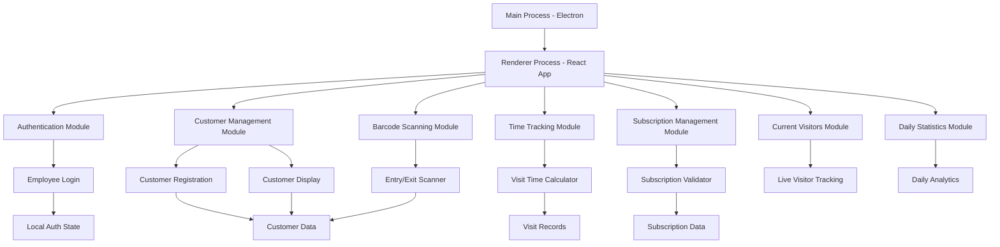
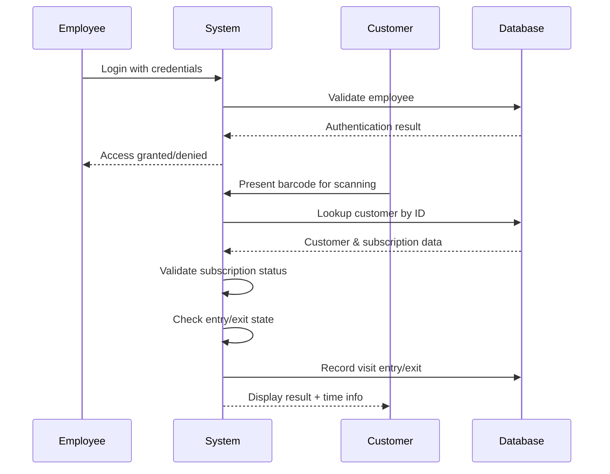

# Gym & Spa Customer Management System - Architecture Documentation

## Project Overview

A desktop Electron application built with React for managing gym and spa customer entry/exit operations, subscription validation, and time tracking. This is a frontend-only application with dummy data for testing purposes.

## Technology Stack

- **Framework**: Electron 40.6.1
- **Frontend**: React 19.2.4 + Vite
- **Styling**: CSS (with potential for CSS modules or styled-components)
- **State Management**: React Context API + useState hooks
- **Build Tool**: Vite with Electron Forge
- **Data Storage**: Local JSON files (dummy data for testing)

## System Architecture



## Application Flow



## Core Modules

### 1. Authentication Module
- **Purpose**: Employee login and session management
- **Components**:
  - `LoginPage` - Employee authentication form
  - `AuthProvider` - Context provider for auth state
  - `ProtectedRoute` - Route protection wrapper
- **Features**:
  - Simple username/password authentication
  - Session persistence
  - Logout functionality

### 2. Customer Management Module
- **Purpose**: Handle customer data and registration
- **Components**:
  - `CustomerRegistration` - New customer form
  - `CustomerProfile` - Display customer information
  - `CustomerSearch` - Search existing customers
- **Features**:
  - Customer registration with basic info
  - Customer profile display
  - Customer search functionality

### 3. Barcode Scanning Module
- **Purpose**: Handle barcode scanning and customer lookup
- **Components**:
  - `BarcodeScanner` - Main scanning interface
  - `ScannerInput` - Manual barcode input alternative
  - `ScanResult` - Display scan results
- **Features**:
  - Camera-based barcode scanning (using web APIs)
  - Manual barcode input option
  - Customer ID extraction from barcode
  - Real-time scanning feedback

### 4. Subscription Management Module
- **Purpose**: Validate and display subscription information
- **Components**:
  - `SubscriptionValidator` - Validation logic
  - `SubscriptionDisplay` - Show subscription details
  - `SubscriptionStatus` - Status indicators
- **Features**:
  - Subscription type validation (daily/monthly/annual)
  - Expiry date checking
  - Subscription renewal alerts
  - Visual status indicators

### 5. Time Tracking Module
- **Purpose**: Track customer visit duration
- **Components**:
  - `TimeTracker` - Visit time calculation
  - `VisitHistory` - Display visit records
  - `TimeDisplay` - Show current visit time
- **Features**:
  - Entry/exit time recording
  - Visit duration calculation
  - Visit history per customer
  - Time display formatting

### 6. Current Visitors Module
- **Purpose**: Real-time tracking of customers currently inside the facility
- **Components**:
  - `CurrentVisitorsList` - Display all customers currently inside
  - `VisitorCard` - Individual visitor information card
  - `LiveTimer` - Real-time timer showing current visit duration
  - `VisitorSearch` - Search and filter current visitors
- **Features**:
  - Real-time list of customers currently inside
  - Live time tracking for each visitor
  - Quick exit functionality
  - Visitor capacity monitoring
  - Emergency evacuation list

### 7. Daily Statistics Module
- **Purpose**: Comprehensive daily analytics and reporting
- **Components**:
  - `DailyDashboard` - Main statistics overview
  - `VisitorMetrics` - Visit count and duration metrics
  - `PeakTimeChart` - Peak hours visualization
  - `RevenueMetrics` - Daily revenue calculations
  - `ExportReport` - Export daily reports
- **Features**:
  - Total daily visitors count
  - Average visit duration
  - Peak hours analysis
  - Membership type breakdown
  - Revenue calculations
  - Hourly visitor flow charts
  - Export to PDF/Excel functionality

## Data Structure

### Customer Data Schema
```json
{
  "customerId": "string",
  "personalInfo": {
    "firstName": "string",
    "lastName": "string",
    "email": "string",
    "phone": "string",
    "dateOfBirth": "string",
    "address": {
      "street": "string",
      "city": "string",
      "zipCode": "string"
    }
  },
  "membership": {
    "membershipId": "string",
    "type": "daily|monthly|annual",
    "startDate": "string",
    "endDate": "string",
    "status": "active|expired|suspended",
    "services": ["gym", "spa", "both"]
  },
  "currentVisit": {
    "isInside": "boolean",
    "entryTime": "string|null",
    "exitTime": "string|null"
  }
}
```

### Visit Record Schema
```json
{
  "visitId": "string",
  "customerId": "string",
  "entryTime": "string",
  "exitTime": "string|null",
  "duration": "number|null",
  "services": ["gym", "spa"],
  "date": "string"
}
```

### Employee Schema
```json
{
  "employeeId": "string",
  "username": "string",
  "password": "string", // In real app, this would be hashed
  "firstName": "string",
  "lastName": "string",
  "role": "receptionist",
  "isActive": "boolean"
}
```

## Component Architecture

```
src/
├── components/
│   ├── common/
│   │   ├── Header.jsx
│   │   ├── Navigation.jsx
│   │   ├── Layout.jsx
│   │   ├── LoadingSpinner.jsx
│   │   └── Modal.jsx
│   ├── auth/
│   │   ├── LoginPage.jsx
│   │   ├── AuthProvider.jsx
│   │   └── ProtectedRoute.jsx
│   ├── customer/
│   │   ├── CustomerRegistration.jsx
│   │   ├── CustomerProfile.jsx
│   │   ├── CustomerSearch.jsx
│   │   └── CustomerList.jsx
│   ├── scanner/
│   │   ├── BarcodeScanner.jsx
│   │   ├── ScannerInput.jsx
│   │   ├── ScanResult.jsx
│   │   └── CameraView.jsx
│   ├── subscription/
│   │   ├── SubscriptionValidator.jsx
│   │   ├── SubscriptionDisplay.jsx
│   │   ├── SubscriptionStatus.jsx
│   │   └── SubscriptionForm.jsx
│   ├── time/
│   │   ├── TimeTracker.jsx
│   │   ├── VisitHistory.jsx
│   │   ├── TimeDisplay.jsx
│   │   └── VisitTimer.jsx
│   ├── dashboard/
│   │   ├── Dashboard.jsx
│   │   ├── QuickActions.jsx
│   │   └── RecentActivity.jsx
│   ├── visitors/
│   │   ├── CurrentVisitorsList.jsx
│   │   ├── VisitorCard.jsx
│   │   ├── LiveTimer.jsx
│   │   └── VisitorSearch.jsx
│   └── statistics/
│       ├── DailyDashboard.jsx
│       ├── VisitorMetrics.jsx
│       ├── PeakTimeChart.jsx
│       ├── RevenueMetrics.jsx
│       └── ExportReport.jsx
├── services/
│   ├── authService.js
│   ├── customerService.js
│   ├── barcodeService.js
│   ├── subscriptionService.js
│   ├── timeService.js
│   ├── visitorsService.js
│   ├── statisticsService.js
│   └── dataService.js
├── data/
│   ├── customers.json
│   ├── employees.json
│   ├── visits.json
│   └── subscriptions.json
├── utils/
│   ├── dateUtils.js
│   ├── validators.js
│   ├── formatters.js
│   └── constants.js
├── hooks/
│   ├── useAuth.js
│   ├── useCustomer.js
│   ├── useScanner.js
│   ├── useTime.js
│   ├── useVisitors.js
│   └── useStatistics.js
└── styles/
    ├── global.css
    ├── components.css
    ├── auth.css
    ├── scanner.css
    ├── dashboard.css
    ├── visitors.css
    └── statistics.css
```

## Key Features Implementation

### 1. Barcode System
- **Encoding**: Customer ID as primary identifier
- **Format**: Numeric ID (e.g., "12345678")
- **Scanning**: Web camera API for barcode detection
- **Fallback**: Manual input option

### 2. Entry/Exit Management
- **Single Terminal**: Same interface handles both entry and exit
- **State Tracking**: Track customer "inside" status
- **Time Calculation**: Automatic duration calculation on exit
- **Validation**: Prevent duplicate entries/exits

### 3. Subscription Validation
- **Real-time Check**: Validate on each scan
- **Status Display**: Visual indicators (active/expired/warning)
- **Expiry Alerts**: Warnings for soon-to-expire memberships
- **Grace Period**: Configurable grace period for expired memberships

### 4. Employee Authentication
- **Simple Login**: Username/password authentication
- **Session Management**: Maintain login state
- **Auto Logout**: Optional timeout for security
- **Single Role**: All employees have same access level

## UI/UX Design Principles

### Dashboard Layout
- **Main Scanner View**: Prominent barcode scanning interface
- **Customer Info Panel**: Display customer details after scan
- **Quick Actions**: Fast access to common tasks
- **Status Indicators**: Clear visual feedback for all operations
- **Navigation Tabs**: Scanner, Current Visitors, Daily Statistics, Customer Management
- **Live Counters**: Real-time visitor count and capacity status

### Current Visitors Page Layout
- **Visitor Cards Grid**: Cards showing each customer currently inside
- **Live Timers**: Real-time duration for each visitor
- **Quick Actions**: Fast exit, emergency evacuation
- **Search/Filter**: Find specific visitors quickly
- **Capacity Indicator**: Visual capacity status

### Daily Statistics Page Layout
- **Key Metrics Dashboard**: Total visits, average duration, revenue
- **Time Charts**: Hourly visitor flow visualization
- **Breakdown Charts**: Membership types, services used
- **Export Tools**: PDF/Excel report generation
- **Date Range Selector**: View statistics for different periods

### Color Coding
- **Green**: Active subscriptions, successful entries
- **Yellow**: Warnings, expiring soon
- **Red**: Expired subscriptions, errors
- **Blue**: Information, neutral states

### Responsive Design
- **Primary Resolution**: Optimized for desktop terminals
- **Minimum Width**: 1024px recommended
- **Touch Friendly**: Large buttons for touch screens
- **Accessibility**: WCAG compliance considerations

## Security Considerations

### Data Protection
- **Local Storage**: All data stored locally (no external transmission)
- **Input Validation**: Sanitize all user inputs
- **Error Handling**: No sensitive data in error messages
- **Session Security**: Secure session management

### Access Control
- **Authentication Required**: All features behind login
- **Session Timeout**: Optional auto-logout
- **Audit Trail**: Log important actions
- **Data Backup**: Regular data backup recommendations

## Performance Optimization

### Data Management
- **Lazy Loading**: Load data as needed
- **Caching**: Cache frequently accessed data
- **Indexing**: Fast customer lookup by ID
- **Cleanup**: Regular cleanup of old visit records

### UI Performance
- **Virtual Scrolling**: For large customer lists
- **Debounced Search**: Optimize search performance
- **Optimized Rendering**: Minimal re-renders
- **Progressive Loading**: Show content as it loads

## Testing Strategy

### Unit Testing
- **Components**: Test individual React components
- **Services**: Test business logic functions
- **Utils**: Test utility functions
- **Validation**: Test input validation

### Integration Testing
- **User Flows**: Test complete workflows
- **Data Flow**: Test data flow between components
- **Authentication**: Test login/logout flows
- **Scanner Integration**: Test barcode scanning flow

### Test Data
- **Sample Customers**: 50+ test customers with various subscription types
- **Employee Accounts**: Test employee accounts
- **Visit History**: Historical visit data for testing
- **Edge Cases**: Expired subscriptions, duplicate scans, etc.

## Deployment Configuration

### Electron Build Settings
- **Window Size**: 1200x800 minimum
- **Permissions**: Camera access for barcode scanning
- **Auto-updater**: Future consideration for updates
- **Platform Support**: Windows, macOS, Linux

### Environment Configuration
- **Development**: Hot reload, debug tools
- **Production**: Optimized build, no debug tools
- **Testing**: Test data, mock services
- **Demo**: Sample data for demonstrations

## Future Enhancements

### Phase 2 Features
- **Reports**: Visit analytics and reporting
- **Photo Integration**: Customer photos in profiles
- **Multiple Locations**: Support for multiple gym locations
- **Advanced Permissions**: Manager vs. receptionist roles

### Phase 3 Features
- **Mobile App**: Customer mobile application
- **Payment Integration**: Handle membership payments
- **Equipment Tracking**: Track equipment usage
- **Class Scheduling**: Integration with class schedules

### Technical Improvements
- **Real Database**: Replace JSON files with SQLite
- **API Integration**: Connect to external systems
- **Cloud Backup**: Cloud-based data backup
- **Advanced Analytics**: Detailed usage analytics

## Development Guidelines

### Code Standards
- **React Functional Components**: Use hooks over class components
- **ES6+ Syntax**: Modern JavaScript features
- **JSX Best Practices**: Clean, readable JSX
- **Error Boundaries**: Proper error handling

### File Organization
- **Component Grouping**: Group related components
- **Service Layer**: Separate business logic
- **Consistent Naming**: Clear, descriptive names
- **Documentation**: JSDoc comments for complex functions

### Version Control
- **Feature Branches**: Develop features in separate branches
- **Commit Messages**: Clear, descriptive commit messages
- **Code Reviews**: Peer review for all changes
- **Release Tags**: Tag stable releases

---

This architecture provides a solid foundation for building a comprehensive gym and spa customer management system with room for future enhancements while maintaining simplicity and usability for daily operations.